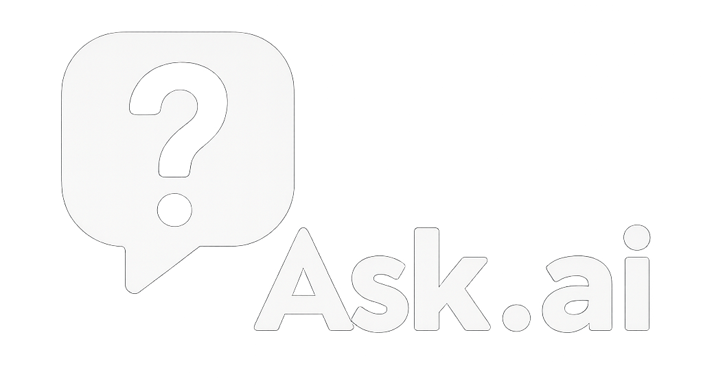

<div align="center">
  <br>
  <br>
  <b>Ask anything, anywhere, anytime.</b>
  <br>
  <em>
    The AI assistant that's always a hotkey away—type or talk, snap a screenshot, and get instant answers. All on your desktop.
  </em>
</div>

#  Ask.AI

A modern, privacy-conscious, and deeply personal desktop AI companion for Windows. Ask.AI is more than a chatbot—it's your always-on, voice-enabled, vision-capable, memory-empowered digital friend. Built with .NET 9, WPF, and OpenAI APIs, Ask.AI brings instant answers, playful conversation, and powerful productivity to your fingertips.

---

## ✨ Why Ask.AI?
- **Instant, global overlay:** Summon your AI from anywhere with <kbd>Alt</kbd>+<kbd>Space</kbd>.
- **Personality & Memory:** Skai, your AI, learns about you, adapts, and remembers your preferences.
- **Voice & Vision:** Speak, listen, and show—Ask.AI handles text, voice, and screenshots.
- **Privacy-first:** All memory is local and encrypted. You control your data.
- **Beautiful, modern UX:** Minimal, fast, and distraction-free.

---

## 🚀 Features
- **Global Hotkey Overlay:** Borderless, semi-transparent, always at your fingertips.
- **Pin/Unpin:** Keep the overlay visible or let it auto-hide.
- **Conversational AI:** Markdown-rendered chat with OpenAI GPT-4 Turbo.
- **Vision Q&A:** Instantly screenshot and ask about anything on your screen (GPT-4V).
- **Voice Input/Output:** Push-to-talk, Whisper speech-to-text, and natural voice replies (Azure/ElevenLabs).
- **Personal Profile:** Skai adapts to your name, interests, and preferred tone.
- **Memory:** Local, encrypted message storage and semantic recall.
- **Settings:** Edit/reset your profile, toggle TTS, and more.
- **Privacy:** No data leaves your device except for API calls you approve.

---

## 🖼️ Screenshots
<!-- Add screenshots or GIFs here for best effect -->

---

## ⚡ Quick Start
1. **Clone the repo:**
   ```sh
   git clone https://github.com/YOUR-USERNAME/AskAI.git
   cd AskAI
   ```
2. **Set up OpenAI API key:**
   - Create a `.env` file in `src/Core` with:
     ```
     OPENAI_API_KEY=your-key-here
     ```
3. **Build and run:**
   ```sh
   dotnet run --project src/UI/UI.csproj
   ```

---

## 🛠️ Architecture
- **.NET 9, WPF:** Modern, native Windows desktop app.
- **src/Core:** API integration, business logic, and memory.
- **src/UI:** WPF overlay, chat, and user experience.
- **src/Voice, src/Vision:** Voice and image features.
- **Modular:** Easy to extend with new skills, plugins, or providers.

---

## 🌱 Roadmap
- **Deeper personalization:** More adaptive, emotionally intelligent Skai.
- **Plugin system:** Let users add new skills and integrations.
- **Cross-platform:** Mac/Linux support (via Avalonia or MAUI).
- **More voice/vision:** Smarter, more natural multimodal interaction.
- **Community features:** Share prompts, plugins, and experiences.

---

## 🤝 Contributing
- PRs and issues welcome! See [CONTRIBUTING.md](CONTRIBUTING.md) for guidelines.
- Looking for help with: UI polish, plugin system, accessibility, and more.

---

## 📄 License
MIT (see LICENSE) 